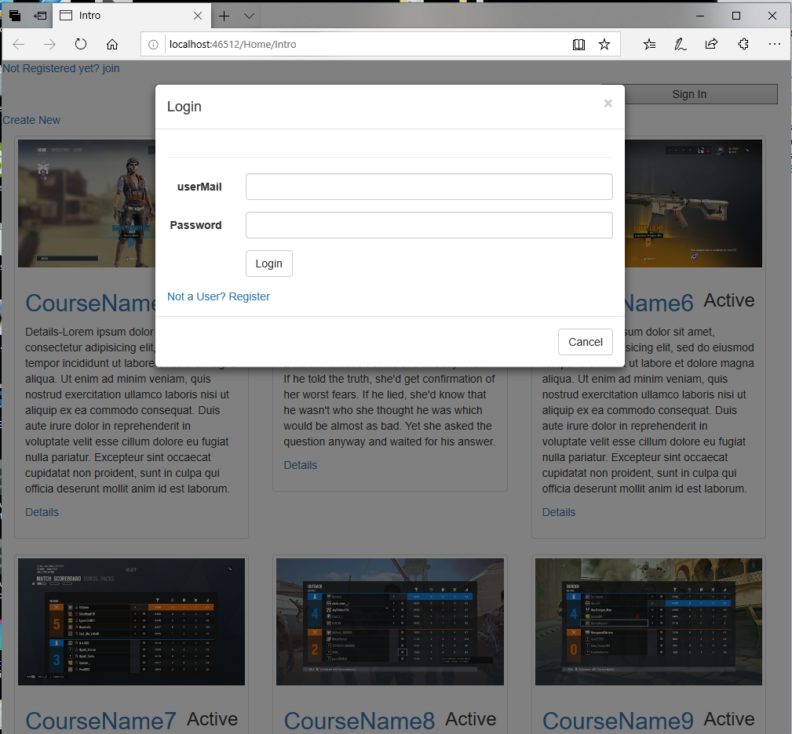

# Scholario
An online platform where users can learn, earn, and exercise according to their expertise in their specific sectors via associating with the platform.

# Online Teacher:

-no certification instead points;
-ECA

contains two types of classrooms:
-free (Designed by the site’s fixed  instructors)
-Curriculum Controlled(Will be designed by the person who wants to provide the class/// Kind of like google classroom)
Free:
include branches or topic specialization
recognition/recommendation can be given as a badge with the percentage of achievements

**Organisation Controlled:

Fixed course 
The curriculum is fixed for every course
 The teacher will design the course keeping in mind the functionality of our site

*Completing free/curricular or any practices on the platform will increase the level

[https://learn.datacamp.com/]
[https://www.hackerrank.com/dashboard]
Virtual Screening for mental health:

-Q&A 
-the result will provide suggestions & medication & percentage if above 70%

[https://www.helpyourselfhelpothers.org/]

----------------------------------------------------------------------------------------------------------------------------
   Learning Web Feature list

1.Instructor(Will design course keeping in mind the functionality(points, assessments, certifications) of the site)

Provide points value for each assessment on a particular course
Provide required audio, video, text, code snippets or other files for the course
Showcase Projects (opensource)
Will provide assessments (free or course-related)
2.Student

Can take course
Can only take the assessment without taking the course
Can see friends profile and Score 
WIll see a Ranking list of student’s friends 
WIll see  global Ranking list 

3.Admin
Viewer
Modifier
4.Course
Open for all
Person controlled
5.Assessment
Different types of Assessment Depending on Checking type 
Automated
Checked by another student (Writings)
Practice Assessment points will be sent automatically to its Instructor.
Different types of Assessment depending on Instructor’s selected option
Course-related assessment
Assessments to provide the course free

6.Projects:
Checked by an instructor(Projects)
Will provide link

**7.Forum:

